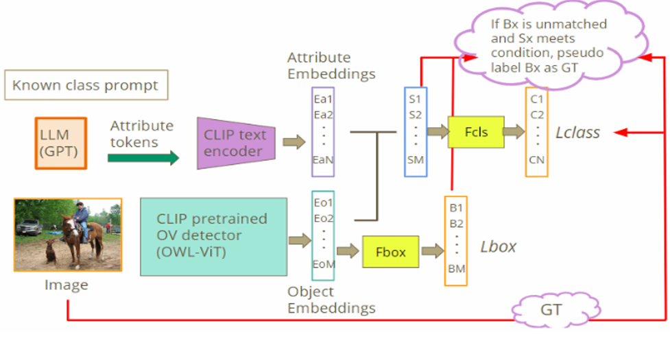

# Open World Object Detection
## Introduction

This project explores **Open World Object Detection (OWOD)** and **Open Vocabulary Detection (OVD)** by leveraging vision-language models. Traditional object detection systems are restricted to a fixed set of predefined classes, making them ineffective when encountering novel objects. Our approach integrates large language models, CLIP, and the OWL-ViT detector to bridge vision and language embeddings. By exploiting attribute-based text-image correspondence, the model not only recognizes known classes but also discovers potential unknown objects. These unknowns can then be incrementally added as pseudo-labels, enabling the system to continuously expand its detection capabilities and adapt to open-world scenarios.

## Replicate Guide
 1. Please download the MS COCO dataset and place it in a file hierarchy according to DATASET_SETUP.md
 2. Please ensure that you have all packages installed in the requirements.txt file
 3. Run the training:  
 python main.py --model_name "google/owlvit-base-patch16" --batch_size 10  --PREV_INTRODUCED_CLS 0 --CUR_INTRODUCED_CLS 19 --TCP 29502 
 --dataset SOWODB --image_resize 768 --output_file "owod_base-patch16.csv"  --classnames_file 't1_known.txt' --prev_classnames_file 't1_known.txt'  --test_set "test.txt" --train_set "train.txt" --unk_methods 'sigmoid-max-mcm' --unk_method 'sigmoid-max-mcm'   --unknown_classnames_file "t1_unknown_classnames_groundtruth.txt" --unk_proposal --data_task 'OWOD' --image_conditioned --unmatched_boxes --use_attributes --att_refinement --att_selection --post_process_method attributes --data_root {YOUR_DATA_ROOT} 